# Automatic radiation treatment planning via deep learning-based dose prediction for whole-breast VMAT

Research code for a four-stage whole-breast volumetric-modulated arc therapy (VMAT) workflow: DICOM preprocessing, deep-learning dose prediction, RTDOSE/parameter postprocessing, and RayStation dose mimicking/optimization.

> **Research use only.** This repository is not a medical device and has not been validated for independent clinical use. Predictions and generated plans require institution-specific commissioning, independent dose verification, and review by qualified radiation-oncology professionals. Never commit identifiable DICOM or derived patient data.

## Workflow

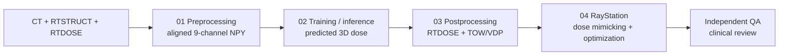

The representative example below follows the same case through the complete pipeline. The top row compares axial dose distributions; the bottom row shows the corresponding DVHs and clinical-goal reference markers.

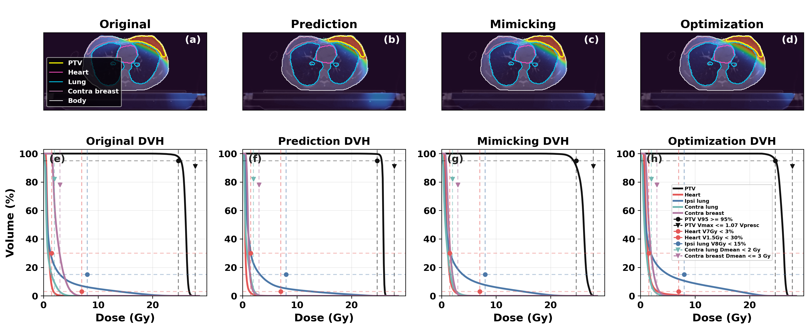

## Repository layout

```text
01_preprocessing/   DICOM alignment and array generation notebooks
02_training/        2D, 2.5D and HD-3D dose models and dose checkpoints
03_postprocessing/  evaluation, NPY→RTDOSE and TOW/VDP inference
04_raystation/      left/right RayStation planning and optimization scripts
docs/               detailed code analysis
image/              dose, DVH and optimization figures used in this README
weights/            parameter-checkpoint download instructions
```

## Installation

Use a Linux workstation with a CUDA-capable PyTorch installation for model training/inference. RayStation scripts run separately on a commissioned RayStation workstation.

```bash
git clone https://github.com/MAKER-park/automatic-wbi-vmat-planning.git
cd automatic-wbi-vmat-planning
python -m venv .venv
source .venv/bin/activate
pip install -r requirements.txt
```

Download the parameter checkpoints described in [`weights/README.md`](weights/README.md) from the [`model-weights` Release](https://github.com/MAKER-park/automatic-wbi-vmat-planning/releases/tag/model-weights). Clinical DICOM and derived arrays are intentionally not distributed.

Before running any script, configure paths and privacy settings from [`config.example.env`](config.example.env). The complete variable reference and DICOM privacy limitations are documented in [`docs/CONFIGURATION.md`](docs/CONFIGURATION.md). Never commit the resulting local configuration.

## End-to-end use

### 1. Prepare data

De-identify DICOM before moving it to the research environment. In `01_preprocessing/interpolate_ct_first.ipynb`, configure input/output roots and verify the ROI-to-channel mapping. Run the notebook to create paired arrays:

```text
data/
├── Train/{CT_and_Contour,Dose}/
├── Validation/{CT_and_Contour,Dose}/
└── Test/{CT_and_Contour,Dose}/
```

`CT_and_Contour` must have shape `(H,W,Z,9)` and dose `(H,W,Z)`, with identical geometry and deterministic case pairing. Inspect several overlays before training.

### 2. Predict dose with the recommended 3D path

From the 3D model directory, adjust dataset paths in the scripts, then run stage 1 and stage 2:

```bash
cd 02_training/5.HD-3D-unet_DVH_LOSS
python 0.train-HD-3D-Unet-DVH_loss-1stage.py
python 0.train-HD-3D-Unet-DVH_loss-2stage.py
python 1.inference_3d_2stage.py
```

For pretrained inference, retain `weights/best_model_weight_stage2.pth` and point the inference script to the test `CT_and_Contour` directory. Output is a normalized predicted-dose NPY volume. The alternative 2D/2.5D scripts are preserved for comparison; their filenames and local path constants should be reviewed before execution.

### 3. Evaluate and create RTDOSE

Run the matching evaluation script in `03_postprocessing` after configuring ground-truth and prediction directories. For RayStation import, configure `03_postprocessing/npy_to_rtdose.py` with the predicted array, a case-matched reference RTDOSE, and output path. Verify the resulting SOP class, UIDs, Frame of Reference, grid dimensions/offsets, orientation, `DoseUnits`, `DoseType`, `DoseSummationType`, and `DoseGridScaling` using a DICOM validator and visual overlay.

The following examples compare reference dose, predicted dose and their voxel-wise difference for left- and right-sided cases at two axial levels. Contours identify the target and relevant organs at risk. Difference maps should be interpreted together with DVH and clinical endpoint evaluation rather than as a standalone acceptance test.

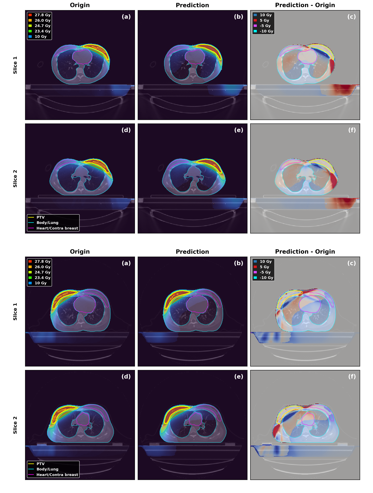

### 4. Predict RayStation mimicking parameters

Example for the 3D dose model:

```bash
python 03_postprocessing/5.HD-3D-unet_DVH_LOSS/predict_mimicking_parameters.py \
  --pred_dir outputs/predicted_dose \
  --ct_dir data/Test/CT_and_Contour \
  --model_path weights/parameter_models/3d_best_model.pth \
  --output_dir outputs/mimicking_parameters \
  --dose_source pred \
  --img_size 256 256 256 \
  --device cuda \
  --scan_mode all_npy
```

The main output, `final_prediction.csv`, contains one row per case with `TOW` (Target:OAR weight ratio) and `VDP` (voxel dose priority). Confirm filename matching in `inference_details.csv`; failed cases appear in `missing_matches.csv`. These values are model recommendations, not automatically safe RayStation settings.

The two outputs correspond to the fields in RayStation's dose-mimicking dialog:

<p align="center">
  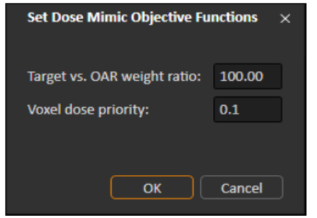
</p>

### 5. Use the result in RayStation

1. Work on a non-clinical/test database and import the case-matched predicted RTDOSE.
2. Confirm anatomy, laterality, ROI names, registration/frame of reference and dose-grid alignment.
3. Choose one angle script for the correct side and model family (`01`=2D, `02`=2.5D, `03`=3D).
4. In RayStation dose mimicking, use the reviewed TOW and VDP values from `final_prediction.csv`.
5. Run `04_*_COPY_*_angle.py` to export/copy the mimicked plan, then run `05_*_OPT_REV.py` for goal-driven optimization.
6. Recalculate dose with the commissioned algorithm and complete independent patient-specific QA and clinical approval.

Site-specific prerequisites and script order are detailed in [`04_raystation/README.md`](04_raystation/README.md); code behavior is documented in [`docs/CODE_GUIDE.md`](docs/CODE_GUIDE.md).

## Cohort-level performance visualization

The figures below summarize the study-level behavior of the dose-prediction and RayStation dose-mimicking workflow. They should be interpreted as descriptive research results from the evaluated cohort, not as acceptance criteria for another institution, scanner, contouring protocol, RayStation version or patient population.

### Dose-prediction endpoint accuracy

The first endpoint summary compares predicted dose against the original clinical dose for target coverage, high-dose target behavior, OAR dose metrics and total voxel-wise MAE. The results show model-dependent trade-offs: the 2D and 2.5D models show lower total MAE in this cohort, while the 3D model shows a stronger PTV V95 tendency but higher voxel-wise MAE. Because endpoint accuracy and spatial dose similarity do not always move together, model selection should be validated against the intended clinical endpoint set.

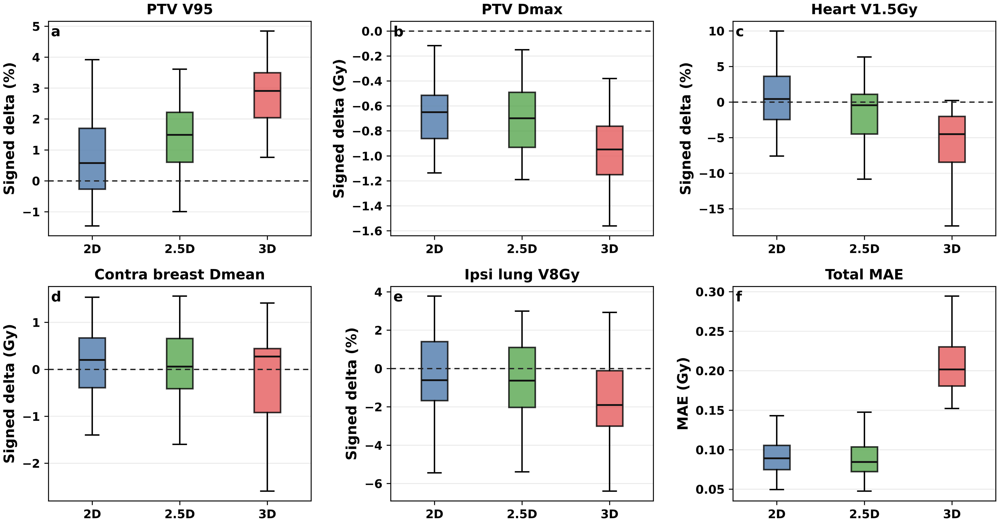

### DVH-guided training effect

For the 2.5D and 3D workflows, DVH-guided training shifts several clinically relevant endpoints compared with the non-DVH-guided baseline. The displayed cohort statistics show significant differences for multiple target and OAR endpoints, including PTV V95, PTV Dmax, Heart V1.5Gy and ipsilateral lung V8Gy. This supports the use of DVH-aware objectives when the downstream planning task depends on clinical dose-volume endpoints rather than only voxel-wise error.

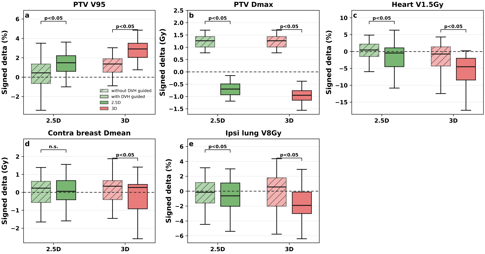

<details>
<summary><strong>Representative DVH-guided DVH examples</strong></summary>

The example DVHs show how the DVH-guided model can alter target and OAR curves relative to the non-DVH-guided prediction and original clinical dose. These examples are visual aids; cohort-level endpoint statistics should be used for quantitative interpretation.

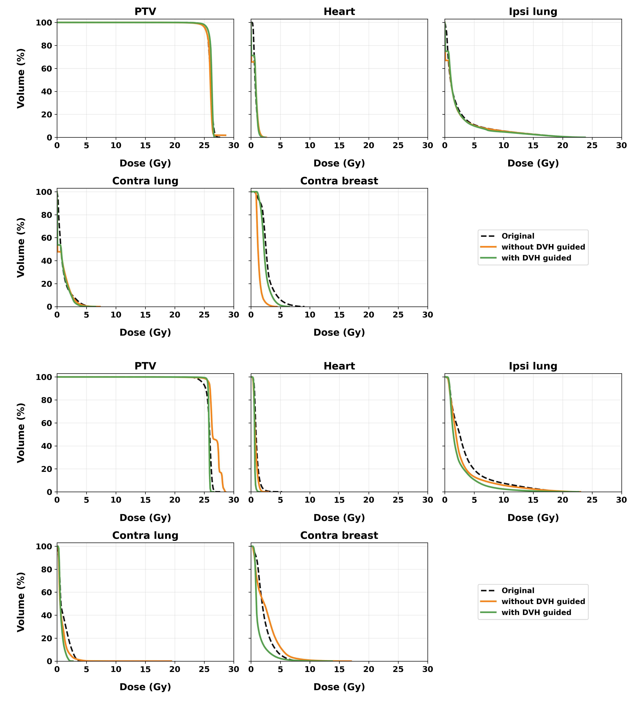

</details>

### RayStation mimicking-parameter effect

The trained parameter models recommend the two RayStation dose-mimicking inputs, Target:OAR weight ratio (TOW) and voxel dose priority (VDP), from the predicted dose and anatomy channels. Compared with default mimicking settings, the recommended parameters reduce several OAR endpoint deviations in this cohort, especially heart, ipsilateral lung and contralateral lung metrics. The PTV V95 behavior remains a trade-off and must be reviewed with the full clinical-goal set before plan acceptance.

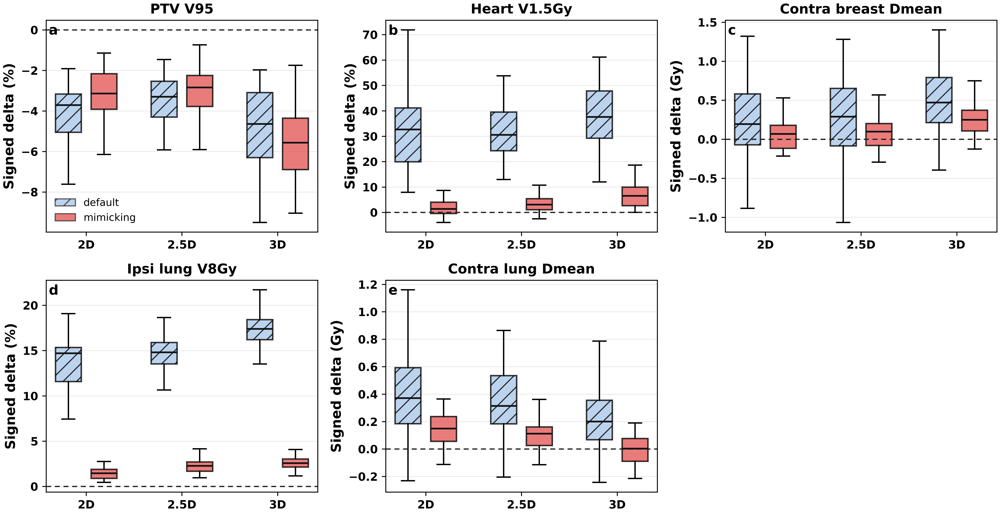

The SSIM trend provides a complementary spatial-distribution view. Across isodose thresholds, predicted-parameter mimicking generally tracks the predicted dose more closely than default mimicking, indicating that the parameter recommendation step improves the geometric similarity of the mimicked dose distribution to the neural-network dose prediction.

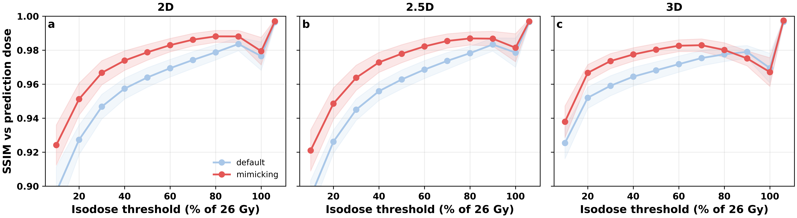

<details>
<summary><strong>Representative RayStation mimicking dose-map example</strong></summary>

The dose-map example illustrates the same behavior visually: default mimicking leaves larger local differences from the predicted dose, while the predicted-parameter mimicking result more closely follows the prediction in the displayed axial slice.

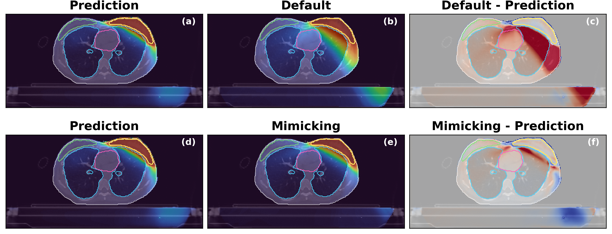

</details>

### Final optimization endpoint summary

The following box plots summarize six planning endpoints across four stages: original clinical dose, neural-network prediction, RayStation mimicking and final optimization. Dashed lines denote the displayed clinical criteria. These figures are intended to show the complete workflow trajectory from dose prediction through RayStation optimization.

<details>
<summary><strong>2D model results</strong></summary>

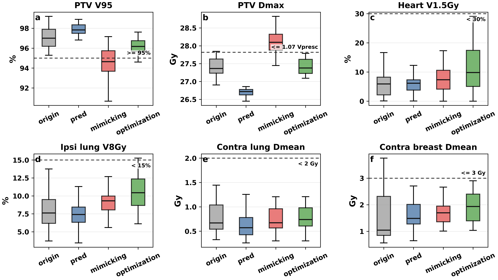

</details>

<details>
<summary><strong>2.5D model results</strong></summary>

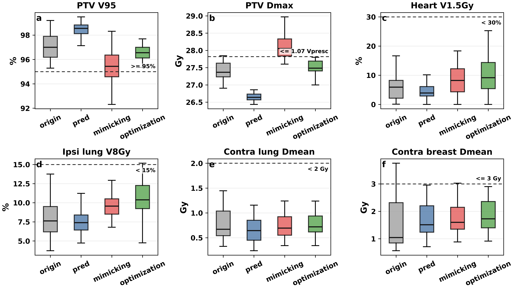

</details>

<details>
<summary><strong>3D model results</strong></summary>

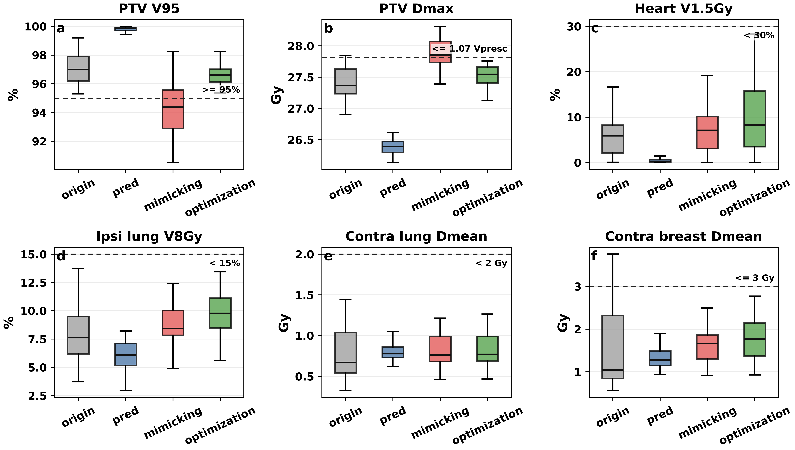

</details>

## Known limitations

- Paths and several experiment settings remain script constants inherited from the research workflow.
- The preprocessing notebooks are not a single command-line pipeline and require explicit ROI/channel verification.
- Parameter checkpoints are large Release assets; their training labels/ranges must be independently confirmed before clinical translation.
- RayStation APIs vary by release, and the scripts contain institution-specific plan/template assumptions.
- No patient data or example clinical DICOM is distributed.

## Citation

If this code supports a publication, cite the article *Automatic radiation treatment planning via deep learning-based dose prediction for whole breast volumetric-modulated arc therapy*. Add the final authors, journal, year and DOI here when available.

## License

No open-source license has yet been selected. Copyright remains with the authors. Add an institution-approved license before inviting third-party redistribution or modification.
